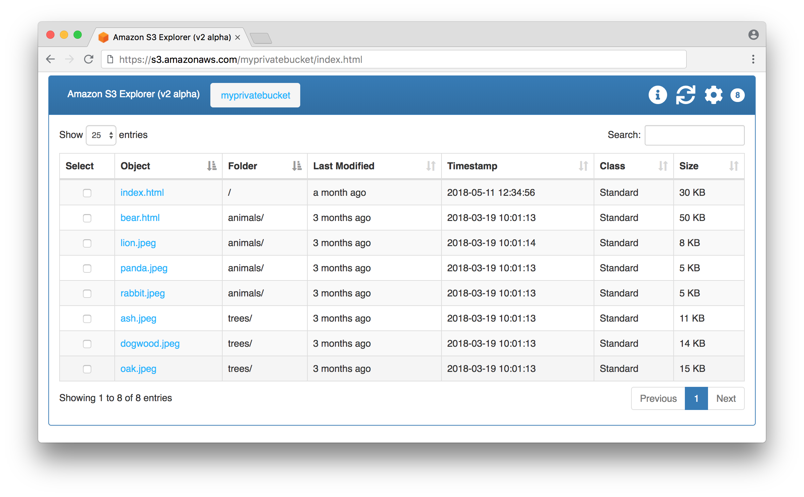
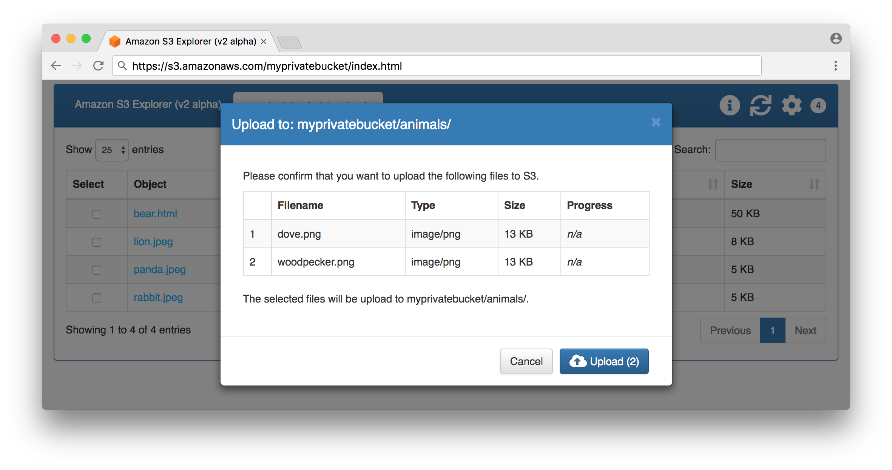
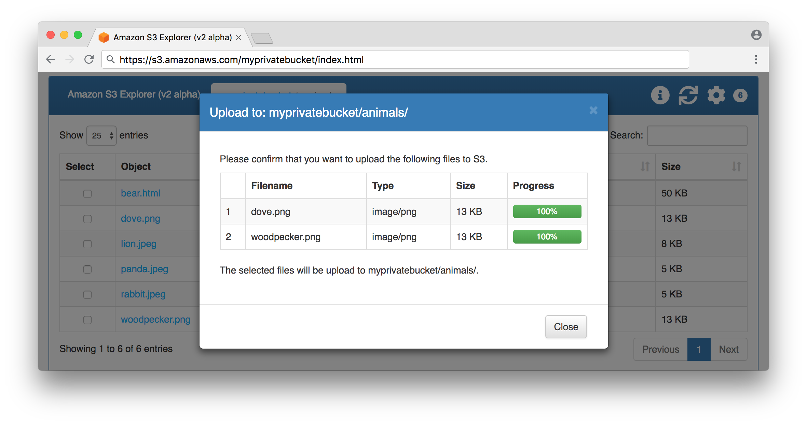

# AWS S3 Explorer

This is an S3 Explorer for AWS. It provides a simple and straightforward way for users to login using SSO and explore available S3 Buckets. Everything is done in the browser and requires only minimal setup using either [AWS Cognito](https://) or [Authress](https://authress.io).


## [Go to the Explorer](https://rhosys.github.io/aws-s3-explorer)


## Setup
Most of the setup is just the auth provider, which involves:
1. Configuring your SSO OAuth provider
1. Configuring Cognito or Authress to link to the provider
1. Setting the redirect url to point back to the S3 Explorer

There are two options for this last step, the redirect can point to either the open source hosted instance running in github @ https://console.rhosys.ch or feel free to clone and deploy to your own private cloud.

### Cognito Setup
Deploy a Cognito User Pool configured with associated providers, create an IAM role which trusts the Cognito Pool, and attach an IAM policy that has fully access to the buckets your users care about.

### IAM Policy for Using S3 Explorer

To access the contents of a private Amazon S3 bucket named BUCKET, you will need to set the IAM policy assigned to the user via authentication to allow access to that bucket.

```json
{
  "Version": "2012-10-17",
  "Statement": [
    {
      "Effect": "Allow",
      "Action": [
        "s3:List*",
        "s3:Get*",
        "s3:Put*",
        "s3:Delete*"
      ],
      "Resource": [
        "arn:aws:s3:::BUCKET",
        "arn:aws:s3:::BUCKET/*"
      ]
    }
  ]
}
```

### Enabling CORS

In order for S3 Explorer to explore the contents of the BUCKET, BUCKET needs to have the proper Cross-Origin Resource Sharing (CORS) configuration allowing the s3 explorer to make requests to BUCKET. You can do this by going to the Amazon S3 console at <https://console.aws.amazon.com/s3> and selecting BUCKET.

CORS defines a way for client web applications that are loaded in one domain to interact with resources in a different domain.

Note that CORS configurations do not, in and of themselves, authorize the user to perform any actions on the bucket. They simply enable the browser's security model to allow a request to S3. Actual permissions for the user must be configured either via bucket permissions (for public access), or IAM permissions (for private access).

#### CORS for S3 Buckets

```json
[
  {
    "AllowedHeaders": [
      "*"
    ],
    "AllowedMethods": [
      "HEAD",
      "GET",
      "POST",
      "PUT",
      "DELETE"
    ],
    "AllowedOrigins": [
      "https://console.rhosys.com"
    ],
    "MaxAgeSeconds": 3000,
    "ExposeHeaders": [
      "ETag",
      "x-amz-meta-custom-header",
      "x-amz-server-side-encryption",
      "x-amz-request-id",
      "x-amz-id-2",
      "date"
    ]
  }
]
```

(Note: If you intend to allow read-only access, then the `POST`, `PUT`, and `DELETE` and unnecessary)

## Display Options

This application allows visitors to view the contents of a bucket via its folders or by listing out all objects in a bucket. The default view is by folder, but users can choose Initial View: Bucket in Settings to display all objects in the bucket. Note that viewing an entire bucket that contains many objects could overwhelm the browser. We've successfully tested this application on a bucket with over 30,000 objects, but keep in mind that trying to list too many objects in a browser could lead to a poor user experience.


## Screenshots

View all objects in folder:


View all objects in bucket:


Upload objects to a bucket:


Upload objects to a bucket succeeded:


Delete objects from a bucket:


Delete objects from a bucket succeeded:


Bucket information:
