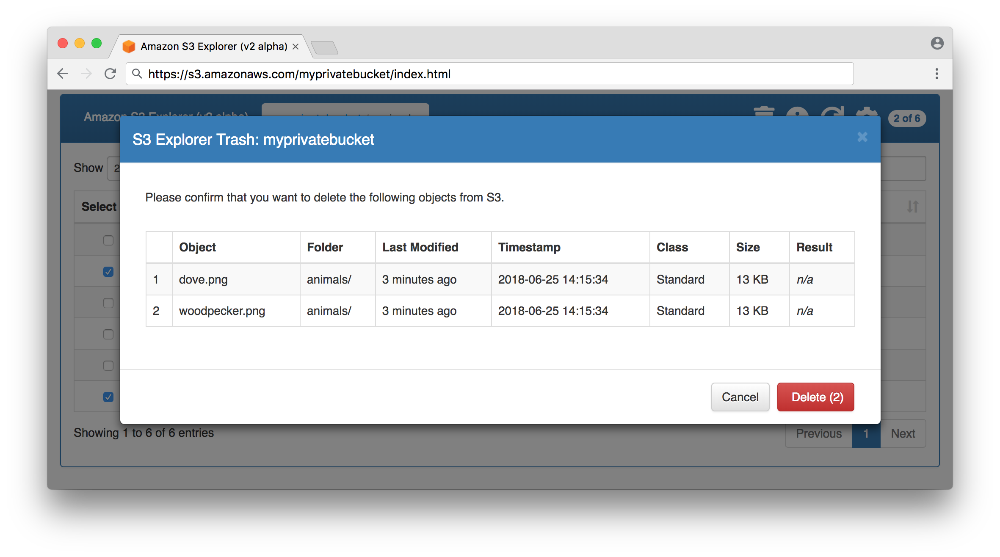
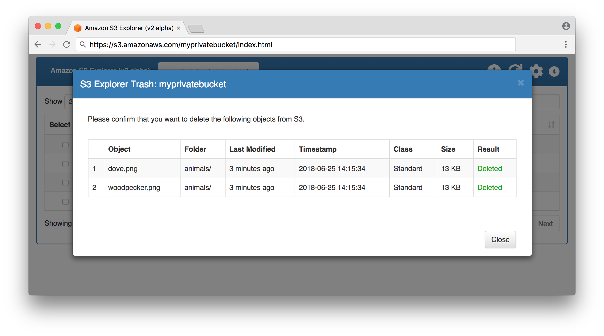

# AWS S3 Explorer

    
    
    

This is an S3 Explorer for AWS. It provides a simple and straightforward way for users to login using SSO and explore available S3 Buckets. Everything is done in the browser and requires only minimal setup using either [AWS Cognito](https://) or [Authress](https://authress.io).

Rhosys hosts an explorer to use out of the box for the community. For obvious security reasons, this is a UI only tool, and makes ZERO api calls to anywhere other than AWS. The following is a link to that explorer. However, if for some reason, other than security there is a benefit to hosting a clone of this, feel free to fork the repo and make any necessary changes. Alternatively, please contribute!
## Go to the => [AWS S3 Explorer](https://rhosys.github.io/aws-s3-explorer/)

## The only setup step
Jump over to the [AWS S3 explorer configuration](https://rhosys.github.io/aws-s3-explorer) to deploy the Cognito CFN template, and configure your SSO provider. That's it!

<!-- ## Display Options

This application allows visitors to view the contents of a bucket via its folders or by listing out all objects in a bucket. The default view is by folder, but users can choose Initial View: Bucket in Settings to display all objects in the bucket. Note that viewing an entire bucket that contains many objects could overwhelm the browser. We've successfully tested this application on a bucket with over 30,000 objects, but keep in mind that trying to list too many objects in a browser could lead to a poor user experience. -->

## Screenshots

View all objects in folder:

View all objects in bucket:

Upload objects to a bucket:

Upload objects to a bucket succeeded:

Delete objects from a bucket:

Delete objects from a bucket succeeded:

## Contribution

### Development
This project uses Vue 3, and as this is much different from Vue 2, recommend reading is available:
* [General Updates](https://v3.vuejs.org/guide/computed.html)
* [Script Setup tags](https://v3.vuejs.org/api/sfc-script-setup.html)
